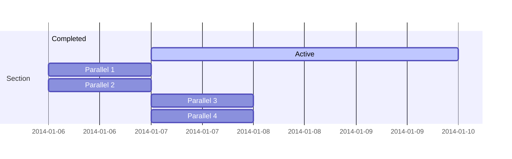

> <h5>Jogos Digitais > Conteúdo</h5>

# Overview

__Prof. Eduardo Ono__

&nbsp;

&nbsp;

## Legislação

* https://www.camara.leg.br/propostas-legislativas/2293861
* PDF: https://www.camara.leg.br/proposicoesWeb/prop_mostrarintegra?codteor=2055353

| Thumb | Descrição |
| :-: | --- |
|  | [Kim Kataguiri] [__Vamos aprovar o MARCO LEGAL DOS GAMES!__](https://www.youtube.com/watch?v=83HrGnJyUEc&t=204s) (13:20, YouTube, Ago/2022)

&nbsp;

## Canais do YouTube Recomendados

* https://www.youtube.com/c/TheCodingTrain/videos

&nbsp;
