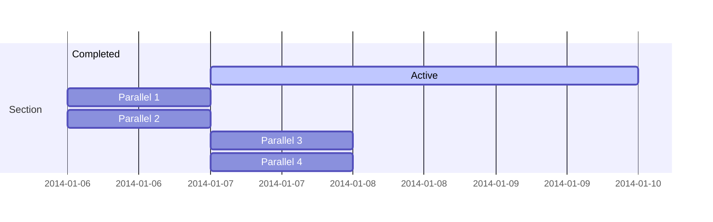

> ### Jogos Digitais

# Overview

Prof. Eduardo Ono

 

## Sugestão de Disiplinas para um Curso de Jogos Digitais 

* Princípios de Jogos Digitais
* Português
* Inglês
* Matemática Discreta
* Probabilidade e Estatística
* Lógica Matemática
* Arquitetura e Organização de Computadores
* Introdução à Programação
* Matemática Aplicada a Jogos Digitais
* Física Aplicada a Jogos Digitais
* Processamento Digital de Imagens
* Computação Gráfica e Multimidia
* Estrutura de Dados
* Banco de Dados
* Roteirização de Jogos
* Sistemas Operacionais
* Programação Orientada a Objetos
* Redes de Computadores
* Engenharia de Software
* Interação Humano-Computador
* Projeto (Design) de Jogos Digitais
* Desenvolvimento Web
* Desenvolvimento para Dispositivos Móveis
* Programação Concorrente e Paralela
* Inteligência Artificial
* Motores de Jogos Digitais
* Jogos Digitais para Consoles

 

